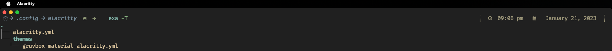

# Alacritty
My Alacritty config file is the result of hours of love and dedication, carefully crafted to enhance my terminal experience. With a color scheme imported from the Gruvbox Material theme, and a combination of FiraCode Nerd Font and Hack Nerd Font for my font configuration, I've ensured that my terminal looks and feels great. I've also enabled clickable URLs and configured my cursor to suit my preferences. Additionally, I've added visual bell animation and set the window dimensions, position, and decorations to my liking. The config also includes options for clipboard, line indicator and scrolling. I've also added live config reload feature to make it easy to make changes on the go. Overall, this config is tailored to my specific needs and preferences and I am excited to share it with others!


---

# Requirement
.
.
.
Install `Homebrew`
```brew
/bin/bash -c "$(curl -fsSL https://raw.githubusercontent.com/Homebrew/install/HEAD/install.sh)"
```

...`optional but STRONGLY recommended`
- ### [starship](https://github.com/aharo24/dot-starship)
- ### [vivaldi](https://github.com/aharo24/dot-vivaldi)


# Installation with Homebrew

...Step 1
Install alacritty: 
``` brew
brew install alacritty
```


...Step 2 
Copy file:
my file to  `~/.config/alacritty/alacritty.yml`

#### [my alacritty file](https://github.com/aharo24/dot-alacritty/blob/main/resources/alacritty.yml)


---

### Shell Support
(I use [fish shell](https://fishshell.com/))

- Bash
- Cmd
- Elvish
- Fish
- Ion
- Nushell
- PowerShell
- Tcsh
- Xonsh
- Zsh


### color-scheme


### [My colorscheme for alacritty in case you want to use it](https://github.com/aharo24/dot-alacritty/blob/main/resources/aharo24-gruvbox.yml)


# [dotfiles](https://github.com/aharo24/opensource/tree/main/dotfiles)
- Please 
	- be patient (slowly merging all dotfiles for public use)

- [alacritty ✅](https://github.com/aharo24/dot-alacritty)
- done
- exa
- fish-abbreviation-tips
- fish
- flameshot
- keycastr 
- obsidian
- raycast
- rectangle
- spunge
- [starship ✅](https://github.com/aharo24/dot-starship)
- sublime
- [vivaldi  ✅](https://github.com/aharo24/dot-vivaldi)
- tmux
- z

# [Contact Info](https://github.com/aharo24/opensource)

Feel free to follow me on twitter: [@aharo24](https://www.twitter.com/aharo24)!

email me with any questions, improvements, bugs, or just to chat.
io.aharo24@gmail.com


