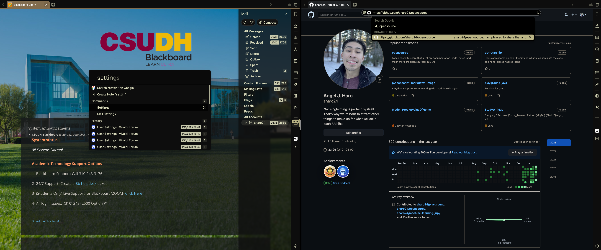
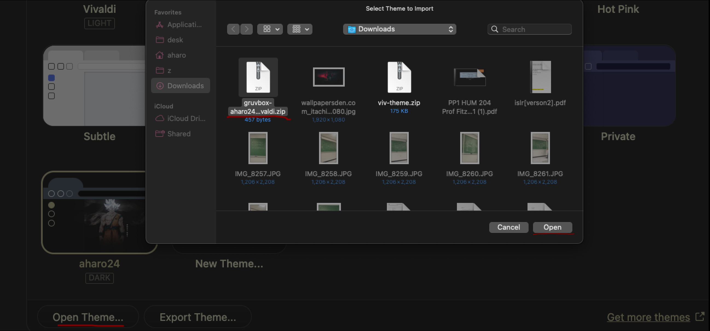

# dot-vivaldi
Introducing my custom theme for Vivaldi, designed with the goal of maximizing productivity for tech-savvy users and programmers. This theme's color balance and sleek design will reduce eye strain for those who spend hours in front of the screen. Additionally, I've included a list of custom hotkeys, including shortcuts for the panel, window, dev, and tabs, which are inspired by popular text editors like nvim, vim, and emacs, making it easy for developers and power users to navigate the browser with ease.

### UI overview



# Requirement
...Step 1:
	Install `Homebrew`
```brew
/bin/bash -c "$(curl -fsSL https://raw.githubusercontent.com/Homebrew/install/HEAD/install.sh)"
```

...Step 2:

...`optional but STRONGLY recommended`
- ### [alacritty](https://github.com/aharo24/dot-alacritty)
- ### [starship](https://github.com/aharo24/dot-starship)


# Installation Process
### ...Step 1:
- ### Install vivaldi
``` brew
brew install --cask vivaldi
```
- if you already have vivaldi
	- you can skip step one and move to step 2:
### ...Step 2: 
- ### [download my zip](https://github.com/aharo24/dot-vivaldi/blob/main/resources/gruvbox-aharo24-vivaldi.zip)

### ...step 3:
- ### [open my zip file in your vivaldi theme settings](https://github.com/aharo24/dot-vivaldi/blob/main/resources/gruvbox-aharo24-vivaldi.zip)
	- Open Theme ---> gruvbox-aharo24.zip ---> open


### ...step 4:
- ### [look at my hotkeys](https://github.com/aharo24/dot-vivaldi/blob/main/resources/vivaldi-resources.md)


---
## [dotfiles](https://github.com/aharo24/opensource/tree/main/dotfiles)
- Please 
	- be patient (slowly merging all dotfiles for public use)

- [alacritty  ✅](https://github.com/aharo24/dot-alacritty)
- done
- exa
- fish-abbreviation-tips
- fish
- flameshot
- keycastr 
- obsidian
- raycast
- rectangle
- spunge
- [starship  ✅](https://github.com/aharo24/dot-starship)
- sublime
- tmux
- [vivaldi  ✅](https://github.com/aharo24/dot-vivaldi)
- z


## [Contact Info](https://github.com/aharo24/opensource)

Feel free to follow me on twitter: [@aharo24](https://www.twitter.com/aharo24)!

email me with any questions, improvements, bugs, or just to chat.
io.aharo24@gmail.com

